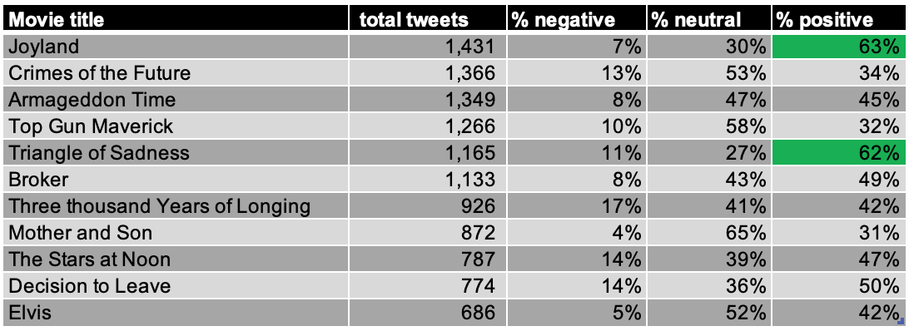
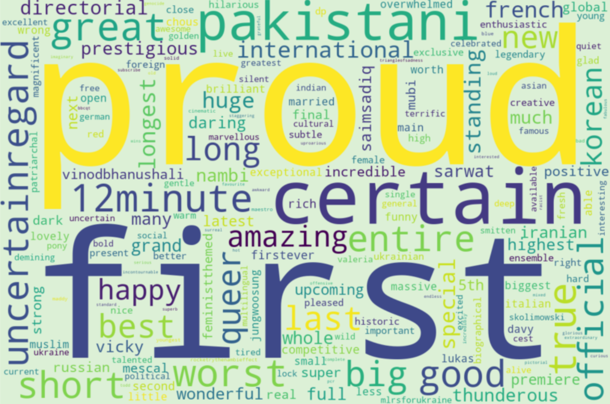

## Natural Language Processing: Cannes film festival 2022 Tweets

### Abstract:
The goal of this project was to find the most discussed movies and assess sentiment towards films from Cannes film festival 2022. Data used included ~29K Tweets with Cannes hashtags from May 17 to May 28 2022. An MMF model with TFIDF vectorizer was chosen for topic modelling and finding subtopics of each movie. VADER and SpaCy were used to analyze sentiment towards the films discussion. 

### Design: 

The unsupervised machine learning problem was set up with the following high level steps: 
- Tweets were scraped and cleaned
- Documents were vectorized
- Main topics were modelled
- For each topic which was a movie, sentiment was analyzed using VADER
- Subtopics were found within each movie to explore more granular topics discussed
- Part of Speech tagging of adjectives was used to try to gauge sentiment in more detail. 
 

### Data:

Tweets with Cannes hashtags from May 17 to May 28 2022 were imported into python using the Twint library. The final dataset consisted of 29,185 tweets/documents and a total of 494,972 terms. 

### Algorithms:

<i>Cleanup and Vectorization</i> 
Tweets were scraped and then cleaned using regex and removing stopwords.
SnowballStemmer and LancasterStemmer were attempted however they didn't improve topic modelling results so the original cleaned tweets were used.

<i>Topic modelling</i> 
LSA, NMF and LDA were trialled for topic modelling. Ultimately the NMF model with a TFIDF vectorizer was chosen as the topics made more sense from visual inspection and were more clearly grouped. n_components = 30 was chosen as it captured the most movie titles without repetition and blurring across topics. 
Subtopics were modelled using NMF on topics which were movies only to analyze more granular topics of discussion on particular movies. 

<i>Sentiment analysis</i> 
VADER was used to compute % positive and % negative tweets for each movie. Tweets had to be stripped of movie titles which were inherently emotive as they were skewing the results e.g. "Triangle of Sadness", "Decision to Leave". When inspecting individual scoring of tweets, it was apparent that VADER did not perform well on colloquialisms and understanding the nuances of tweets. 
SpaCy was attempted next to identify most commonly appearing adjectives as a different means to gauge sentiment. A wordcloud was used to visualize these adjectives and interpret sentiment. 

### Results:

Top 5 tweeted movies and subtopics: 
1. Joyland (standing ovation, Jury prize, Pakistan, debut, contratulations)
2. Crimes of the Future (Kristen Stewart, photocall, screening, Tom Sturridge, David Cronenberg)
3. Armageddon Time (Anne Hathaway, photograph, Deepika Padukone,celebrities, Jeremy Strong)
4. Top Gun Maverick (review, fashion, youth, premiere,wardrobe)
5. Triangle of Sadness (Palme d'Or, Marion Cotillard, Riley Keough, Ruben Ostlund, screening)

VADER sentiment analysis: 

Example wordcloud of Joyland's adjectives:

### Tools:
- Twint to scrape tweets
- Regex for cleaning tweets
- Pandas and NumPy for data manipulation  
- Sklearn for vectorization and topic modelling
- NLTK for Stemming and tokenization
- VADER and SpaCy for sentiment analysis

